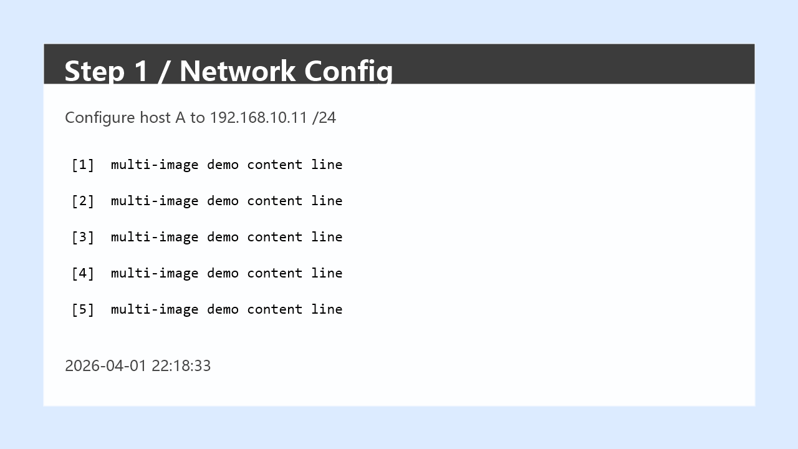
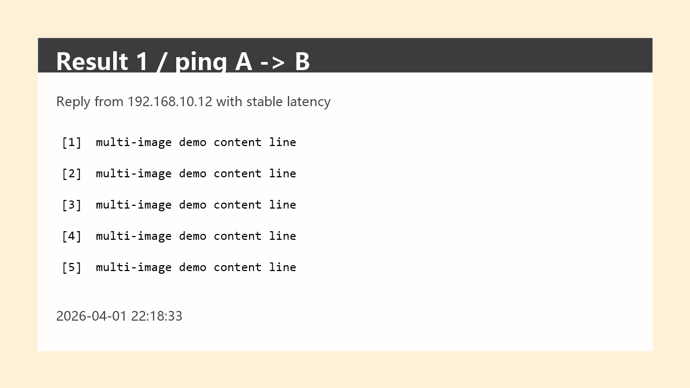

# OpenClaw Experiment Report Skill
> Local OpenClaw workflow for Chinese lab reports: draft report content, fill docx templates, insert screenshots, and run layout checks.

[](https://github.com/lyf94697-droid/openclaw-experiment-report-skill/actions/workflows/quality.yml)
[](https://github.com/lyf94697-droid/openclaw-experiment-report-skill/actions/workflows/smoke-tests.yml)
[](LICENSE)

## 项目简介

这是一个基于 OpenClaw 的实验报告 skill 和 PowerShell 本地流水线。

它不是通用文档引擎。当前重点是把实验主题、要求、教程链接、代码、截图、数据、空白 `docx`/WPS/Word 模板这些材料，收拢成一条可复查的本地流程：先生成结构化中文实验报告，再填充模板、插入截图、生成图注，最后做一轮排版和 layout check，输出可检查的 `docx`。

当前 `main` 分支优先解决“中文大学实验报告”这个具体场景，并保持技术路径务实可落地：以 OpenClaw 为生成入口，以本地脚本做模板处理、插图和最终排版。

## 解决什么问题

实验报告最耗时间的部分，通常不是单纯“写字”，而是材料整理和成品收尾：

- 实验主题、教程网页、代码、截图、数据分散在不同地方
- 正文结构要手动整理成“实验目的、步骤、结果、总结”这类固定章节
- 学校模板往往是空白 `docx`，填字段和填正文都很麻烦
- 截图要决定插在哪里、图题怎么写、几张图怎么排
- 最后标题、正文、图注、封面间距这些排版细节很耗时间

这个仓库就是把这些步骤收拢成一条尽量稳定、可重复的本地流程。

## 主要功能

- 根据实验主题、要求、教程链接、代码、截图、数据等材料生成结构化中文实验报告正文
- 对空白 `docx` / WPS / Word 模板做字段映射和正文填充
- 插入实验截图并生成图注，支持按章节或稳定锚点落位
- 支持图片分组布局，例如两图一行、2x2 图片块这类常见报告排版
- 对标题、章节标题、正文、图注、图片块做基础排版优化
- 支持通过 OpenClaw skill 或本地 PowerShell 入口脚本调用
- 支持基于教程页或参考材料生成内容，但目标是改写和整理，不是长篇照抄

## 工作流程

1. 提供实验主题、要求、教程链接、截图、模板或已有正文
2. 生成结构化中文实验报告正文
3. 填充 `docx` 模板中的字段和章节内容
4. 插入截图并生成图注，必要时做分组布局
5. 对最终文档做排版优化，输出可检查的最终 `docx`

## 演示效果

下面保留一个简化预览；完整的 2x2 图片块示例和 GitHub 友好的演示素材见 [demo/README.md](demo/README.md)。

| 步骤截图预览 | 结果截图预览 |
| --- | --- |
|  |  |

如果你想看完整四图联排效果，直接打开 [demo/README.md](demo/README.md)。

## 当前范围

- 当前版本聚焦中文大学实验报告场景，不承诺任意报告类型都能直接套用
- 当前仓库主要面向 OpenClaw 用户，不是独立桌面应用
- 仓库已经包含 `SKILL.md`、`references/`、`scripts/`、`examples/`、`demo/` 和 GitHub 协作治理文件
- 当前稳定路径是“OpenClaw 生成 + 本地脚本处理模板、图片和排版”
- 常见空白模板、章节正文、截图插入和基础样式处理可以跑通
- 当前暂时不保证 Word/WPS GUI 自动化填写，也不承诺任意复杂模板都能无人工确认处理

## 快速开始

### 1. 安装 skill

方式一：直接 clone 到 OpenClaw 实际加载的 skills 目录。

```powershell
git clone <your-repo-url> "$env:USERPROFILE\.agents\skills\experiment-report"
```

方式二：在已检出的仓库里运行安装脚本。

```powershell
powershell -ExecutionPolicy Bypass -File .\scripts\install-skill.ps1
```

安装后可以运行：

```powershell
openclaw skills list
```

确认 `experiment-report` 已出现。  
如果你的运行时会缓存 skill 列表，再重启 OpenClaw 或刷新 skills。

这个 skill 的常见触发词包括：`实验报告`、`实验模板`、`WPS模板`、`Word模板`、`docx模板`、`lab report`。  
如果想要更稳定地触发，建议直接以 `/experiment-report` 开头。

### 2. 常用入口脚本

最常用的本地入口有 3 个：

- `scripts/build-report-from-feishu.ps1`
  适合飞书或直接聊天场景，负责把生成、模板填充、插图和最终输出串起来
- `scripts/build-report-from-url.ps1`
  适合“教程链接 -> 报告正文 -> 模板填充 -> 最终 docx”这类流程
- `scripts/build-report.ps1`
  适合你已经有正文和模板，只想走确定性的本地 `docx` 打包流程

如果你需要拆开流水线逐步处理，仓库里也已经提供模板抽取、字段映射生成、图片映射生成、插图、样式优化、网页抓取、提示词准备和端到端验证脚本，入口都在 [scripts](scripts) 目录。

其中 `build-report-from-feishu.ps1` 和 `build-report-from-url.ps1` 在需要生成正文时默认使用 `-DetailLevel full`，也就是默认要求输出更完整、不是提纲式的正文。

### 3. 一条常见用法

如果你想走聊天友好的本地封装入口，可以直接用：

```powershell
powershell -ExecutionPolicy Bypass -File .\scripts\build-report-from-feishu.ps1 `
  -ReferenceUrls "https://blog.csdn.net/..." `
  -CourseName "计算机网络" `
  -TemplatePath "E:\reports\template.docx" `
  -StudentName "张三" `
  -StudentId "20260001" `
  -ClassName "计科 2201" `
  -ImagePaths "E:\reports\step-1.png","E:\reports\step-2.png","E:\reports\result-1.png","E:\reports\result-2.png" `
  -OutputDir "E:\reports\final-output"
```

如果你想从教程链接直接走到最终 `docx`，可以用：

```powershell
powershell -ExecutionPolicy Bypass -File .\scripts\build-report-from-url.ps1 `
  -ReferenceUrls "https://blog.csdn.net/..." `
  -CourseName "计算机网络" `
  -TemplatePath "E:\reports\template.docx" `
  -StudentName "张三" `
  -StudentId "20260001" `
  -ClassName "计科 2201"
```

如果你已经有整理好的正文和模板，直接走本地 `docx` 流程：

```powershell
powershell -ExecutionPolicy Bypass -File .\scripts\build-report.ps1 `
  -TemplatePath "E:\reports\template.docx" `
  -ReportPath ".\examples\sample-report.txt" `
  -MetadataPath ".\examples\docx-report-metadata.json" `
  -ImageSpecsPath ".\examples\docx-image-specs-row.json" `
  -RequirementsPath ".\examples\e2e-sample-requirements.json" `
  -StyleFinalDocx `
  -StyleProfile auto
```

补充说明：

- `build-report-from-feishu.ps1` 和 `build-report-from-url.ps1` 会优先从提示词、参考文本或 URL 片段推断 `ExperimentName`；推断不到时才复用最近一次保存的实验名
- 在教程标题或参考文本已经包含实验名称时，can omit `-ExperimentName`
- `build-report.ps1` 支持 `-StyleProfile auto|default|compact|school`
- 如果你想加载自定义排版配置，可以配合 `-StyleProfilePath` 使用
- 正文排版会单独识别步骤编号和 DOS/终端命令，步骤段不做首行缩进，命令段使用等宽字体、浅灰底和更紧凑的单倍行距
- 最终排版会统一标题、正文、图注的字号；表格型模板会尽量保留模板默认字体观感，避免额外强制字体导致成品不像原模板
- 表格型实验报告模板会使用更接近模板默认观感的字号，把正文单元格改为顶部对齐，并减少普通正文的强制分页保持，避免留下过多空白
- 不确定多张截图会被放到哪里时，可以先运行 `scripts/generate-docx-image-map.ps1 -PlanOnly -Format markdown` 输出图片分配预案，确认章节、图注和布局后再生成正式 image map
- 多张图片连续归入同一实验章节时，插图流程会默认使用每行 2 张的分组布局；显式 `ImageSpecs` 里的 `layout` 配置仍然优先生效
- 生成最终 `docx` 后会写出 `layout-check.json`，检查图片数、图注数、残留占位符和常见实验报告章节，summary 里也会记录 `layoutCheckPassed`、错误数和警告数
- `layout-check.json` 会检查图注编号是否连续，summary 里会给出 `layoutCheckMessage`，便于不打开 JSON 也能快速判断排版是否过关

### 4. 飞书或直聊场景补充

如果你走 Feishu 或其他直接聊天场景，有几条经验是稳定有效的：

- 最稳的方式不是让模型临场拼很多中间 JSON，而是直接调用 `scripts/build-report-from-feishu.ps1`
- 飞书里手机直接上传截图时，可以参考 `examples/feishu-uploaded-images-docx-prompt.md`
- 电脑本地直接上传截图时，可以参考 `examples/local-uploaded-images-docx-prompt.md`
- 想一次生成、不等待图片分配确认时，可以参考 `examples/one-shot-uploaded-images-docx-prompt.md`
- 如果你 uploaded images and you also provide local image paths，建议把上传图片当作语义参考，把本地路径当作最终 `docx` 插图文件来源
- 如果运行时把附件提示注入成类似 `media/inbound/example.png` 这样的相对路径，这些路径也可以继续作为 `-ImagePaths` 传给插图流程
- 对于未标注章节的多张截图，脚本会按上传顺序优先把前半归入实验步骤、后半归入实验结果，再对同章节连续图片应用 2 列布局
- 如果聊天运行时根本没有暴露真实附件路径，就应该明确说不能直接插图，而不是假装已经写进 `docx`

### 5. 本地验证

在提交修改或排查问题前，建议先跑一遍烟测：

```powershell
powershell -ExecutionPolicy Bypass -File .\scripts\run-smoke-tests.ps1
```

## 项目现状

当前 `main` 分支可以跑通一条实验报告工作流：生成正文、填模板、插图片、补图注、做基础排版和 layout check。
仓库还在持续迭代中，但当前优先级不是盲目扩场景，而是先把“实验报告”这条链路做得更稳、更好用、更容易复现。
后续扩展会先作为候选模板或实验分支推进，不把新类型文档硬塞进默认主线。

## Roadmap

当前方向：先把实验报告主线做实用，再谨慎推进候选文档类型。

- 继续补常见实验报告模板和模板适配策略
- 强化教程链接、截图、正文、模板之间的本地串联能力
- 增强图片插入、图注和多图布局的配置能力
- 把课程设计、周报、月报、项目文档等先作为候选路径验证
- 只在真实模板和 smoke 覆盖足够后，把新的路径推进稳定主线
- 继续完善样式 profile，让不同学校/模板的排版策略更容易切换

更完整的路线可以看 [ROADMAP.md](ROADMAP.md)。

## 仓库说明 / 协作

这个仓库已经包含开源协作所需的基础文件和流程，包括：

- [README.md](README.md)
- [LICENSE](LICENSE)
- [CONTRIBUTING.md](CONTRIBUTING.md)
- [CHANGELOG.md](CHANGELOG.md)
- [CODE_OF_CONDUCT.md](CODE_OF_CONDUCT.md)
- [SECURITY.md](SECURITY.md)
- [SUPPORT.md](SUPPORT.md)
- `.github/` 下的 issue / PR 模板
- `.github/workflows/` 下的 CI 工作流

如果从 GitHub 公开项目的角度看，这一组文件基本已经构成了仓库当前的 `Repository Health` 基础面。

如果你想继续协作开发，先看 [CONTRIBUTING.md](CONTRIBUTING.md)；如果你只是想快速理解仓库目录和演示素材，可以先看 [demo/README.md](demo/README.md) 和 [examples](examples)。

## License

MIT
