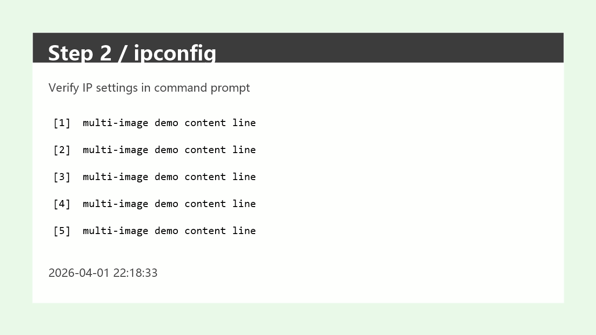
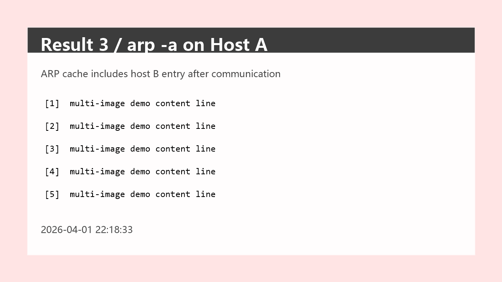

# Demo

This directory contains lightweight assets intended for GitHub repository preview and quick manual checks.

## Included Preview Assets

- `assets/step-network-config.png`
- `assets/step-ipconfig.png`
- `assets/result-ping.png`
- `assets/result-arp.png`

## 2x2 Layout Preview

| Step 1 | Step 2 |
| --- | --- |
|  |  |
|  |  |

The same four assets can be referenced from an image-specs file with a shared layout block:

```json
{
  "images": [
    {
      "path": ".\\demo\\assets\\step-network-config.png",
      "section": "实验结果",
      "caption": "图1 虚拟机网络参数配置界面",
      "layout": { "mode": "row", "columns": 2, "group": "demo-grid" }
    },
    {
      "path": ".\\demo\\assets\\step-ipconfig.png",
      "section": "实验结果",
      "caption": "图2 使用 ipconfig 查看主机地址配置",
      "layout": { "mode": "row", "columns": 2, "group": "demo-grid" }
    },
    {
      "path": ".\\demo\\assets\\result-ping.png",
      "section": "实验结果",
      "caption": "图3 主机之间的 ping 连通性测试结果",
      "layout": { "mode": "row", "columns": 2, "group": "demo-grid" }
    },
    {
      "path": ".\\demo\\assets\\result-arp.png",
      "section": "实验结果",
      "caption": "图4 arp -a 邻居缓存查看结果",
      "layout": { "mode": "row", "columns": 2, "group": "demo-grid" }
    }
  ]
}
```

## Suggested GitHub README Usage

- Link this page from the main README.
- Use one or two of the images above directly in PR descriptions when showing layout-related changes.
- Keep demo assets sanitized and reusable.
